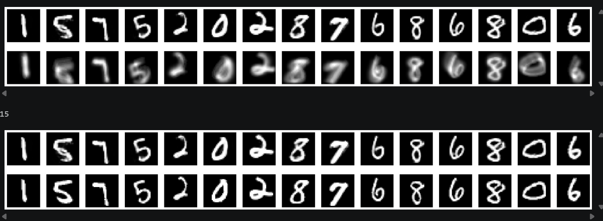

# Motion Deblurring with CNN Autoencoder

## Overview
This project implements a **CNN-based autoencoder** to remove motion blur from images. The blur is synthetically generated by applying 10 random translations (±7% shift) to simulate a shaky-hand effect during photography. The model learns to reconstruct the sharp original image from the blurred input.

## Dataset
- **MNIST** handwritten digits (28×28 grayscale)
- 60,000 training samples / 10,000 test samples
- Blur simulated via sequential random translations using Keras `RandomTranslation`
- Final blurred image = average of all shifted versions

## Model Architecture
A **Sequential CNN Autoencoder** with ~744K trainable parameters.

**Encoder:**
| Layer | Filters | Kernel |
|-------|---------|--------|
| Conv2D + AvgPool + BN | 128 | 9×9 |
| Conv2D + AvgPool + BN | 64 | 7×7 |
| Conv2D + AvgPool + BN | 32 | 7×7 |
| Conv2D + AvgPool + BN | 16 | 5×5 |
| Conv2D + AvgPool + BN + Dropout(0.2) | 16 | 5×5 |

**Latent Space:** Conv2D — 8 filters (2×2)

**Decoder:**
| Layer | Filters | Kernel |
|-------|---------|--------|
| Conv2DTranspose × 2 + BN | 16 | 9×9 |
| Conv2DTranspose × 2 + BN | 32 | 7×7 / 1×1 |
| Conv2DTranspose × 2 + BN | 64 | 5×5 |
| Conv2DTranspose (sigmoid) | 1 | 1×1 |

## Training
- **Loss:** LogCosh
- **Optimizer:** Adam
- **Epochs:** 10 (EarlyStopping, patience=3)
- **Batch size:** 64
- **Validation:** last 10,000 samples of training set

## Results

Top row: **Model predictions (deblurred)**  
Bottom row: **Ground truth (original)**



## Evaluation
Model evaluated using **MSE** over 10 rounds on fresh blurred test batches:

| Metric | Value |
|--------|-------|
| Mean MSE | — |
| Std Deviation | — |

## Requirements
```
tensorflow
keras
numpy
matplotlib
```

## Usage
Open `motion_blur.ipynb` in Jupyter or Google Colab and run all cells.
